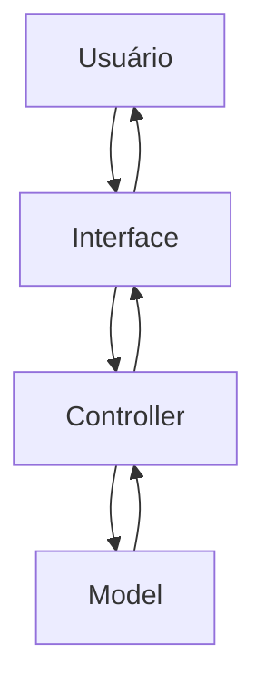

# Documentação de Especificações de Requisitos de Software SRS

## Sistema de Gestão de Quitanda (Quitanda MVC)

**Padrão Internacional:** ISO/IEC/IEEE 29148:2018
**Versão:** 1.0.0
**Data:** 2026-04-14
**Autor:** Larissa Vieira

---

## 1.Introdução

### 1.1 Propósito

Este documento descrve os requisitos do sistema **Quitanda MVC**, com o objetivo de:

* definir funcionalidade
* padronizar entendimentos entre os stakeholders
* servir como base para desenvolvimento e teste

---
### 1.2 Escopo

O Sistema permitirá: 

* Registro de entrada de produtos
* controle de estoque
* registro de vendas
* visualização dos históricos das movimentações

O Sistema será uma aplicação web frontend utilizando:

* HTML
* CSS
* Java Script
* Arquitetura MVC
* Estrutura POO

Objetivos:

---

### 1.3 Definições e Acrônimos

| Termos | Definições |
| - | - |
| Produto | Item Comercializado na quitanda |
| Entrada | Registro de chegada de produto |
| Saída | Registro de venda de Produto |
| Estoque | Quantidade disponível de produtos |

Lista de Acrônimos

* **SGQ:** Sistemas de Gestão de Quitanda
* **RF:** Requisitos Funcionais
* **RNF:** Requisitos não Funcionais
* **UC:** Casos de Uso
* **CA:** Critérios de Aceitação

### 1.4 Visão Geral do Documento

Este documento está organizado em: 

* Introdução e Visão Geral
* Descrição do Sistema
* Requisitos Detalhados
* modelos UML
* Regras de negócio

---

## 2. Descrição Geral do Sistema

### 2.1 Perspectiva do Sistema

O sistema é standalone(frontend), operando em um navegador web.

---
### 2.2 Funções do Sistema

O Sistema deve:
* Cadastrar produtos
* Atualizar estoque
* Registrar Vendas
* Validar Operações
* Exibir Dados

---
### 2.3 Classes de Usuárips

| Usuários | Descrição |
| - | - |
| Estoquista | Gerenciar estoque |
| Caixa | Realizar Venda |
| Repositor | Registrar Entradas |

--- 
### 2.4 Ambiente Operacional

* Navegadores Web (Chrome, Edge, Firefox, Brave)

---

### 2.5 Restrições

* não utiliza Banco de Dados
* dados aramazenado na memória
* sem autenticação

---

### 2.6 Suposições

* Usuários possui conhecimento de Informática
* Volume de dados é pequeno

---

## 3. Requisitos do Sistema

